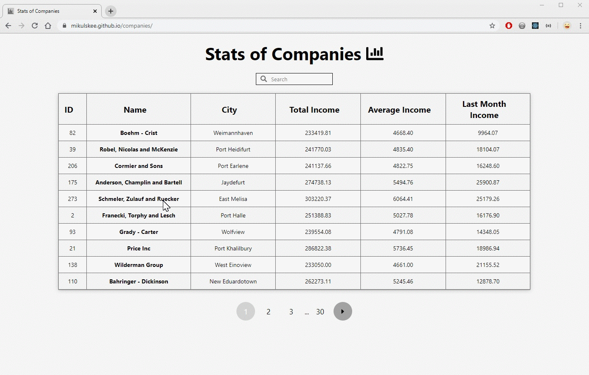

# Stats of Companies

> Simple app for fetching and displaying companies stats.

> **Live demo**: _https://mikulskee.github.io/companies_



## Getting started

These instructions will get you a copy of the project up and running on your local machine for development and testing purposes.

### Prerequisites

You need to have installed `npm` or `yarn`

### Installing

First of all download or clone the repository to your local machine.

Check if you have `node` and `npm` installed. Run this command in your terminal:

```
node -v
```

To confirm that you have npm installed you can run this command in your terminal:

```
npm -v
```

If you checked your node and npm install all dependecies with:

```
npm install
```

Now you are ready to view the app. Just type in terminal:

```
npm start
```

Browser will automatically open `localhost:3000/`

### Deployment

To deploy application to github pages run:

```
npm run deploy
```

This will start a build process and push the production version to the `gh-pages` branch

## Built With

- [Create React App](https://github.com/facebook/create-react-app) - JavaScript Framework which I used
- [styled-components](https://www.styled-components.com/) - Writing CSS in JavaScript

## Support

Reach out to me at one of the following places!

- Website at <a href="https://codeverse.pl" target="_blank">`codeverse.pl`</a>
- LinkedIn at <a href="https://www.linkedin.com/in/mikulski-mateusz/" target="_blank">`Mateusz Mikulski`</a>

---

## License

This project is licensed under the MIT License
